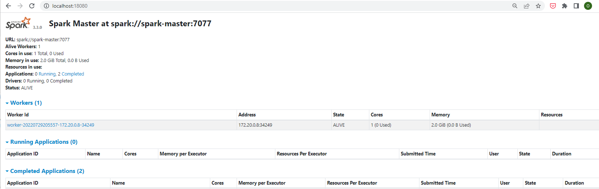
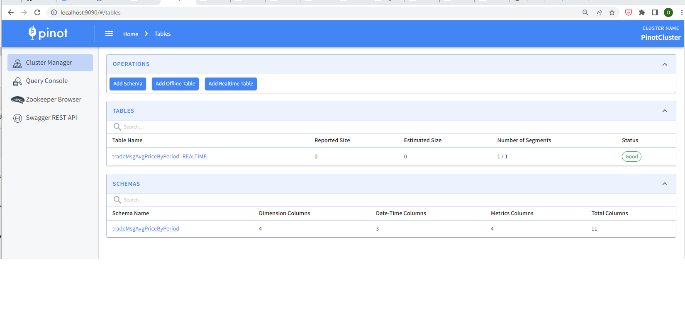
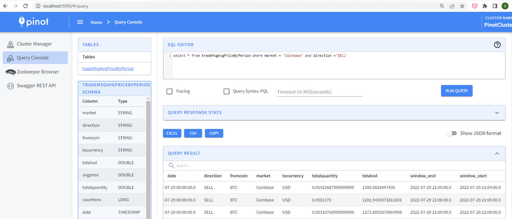

# Apache Pinot streaming project
This project demonstrates the ability of Apache Pinot to consume continuous realtime information from a Kafka source. 

The kafka source is itself populated by aggregating data based on realtime cryptocurrency trading information from a public url: www.cryptocompare.com ingested and processed by Apache Spark. Spark is only used to perform aggregation of avg prices per coin per exchange and then bucket the data in window intervals of 1 minute to make meaningful sense out of the data being received. 

The entire running of this project has been dockerized to allow for easy setup.


## Prerequisites
To run the project, you must have the following installed on your local system.
- Intellij IDEA ide 2022.1 or later with Scala plugin and SBT plugin 1.6.2 enabled.
- Docker desktop v4.10.1 or later and docker-compose v1.29 or later

## Setup
The project makes use of docker images and running the project the first time may take some time due to network speed when pulling the images from docker. The following docker images are used:
1. bitnami/zookeeper:3.5.5
2. bitnami/kafka:2.2.1
3. apachepinot/pinot:0.9.3
4. bitnami/spark:3.3.0

To setup your environment, pls follow the steps below.
1. Clone this project and setup your IDE to resolve all dependencies required by this project.
2. Create a free account on CryptoCompare by going to the site below.
``` 
https://min-api.cryptocompare.com/ 
```
3. Follow the instructions to setup your API_KEY. This API_KEY is what will grant the access to stream live messages from the exposed cryptocompare API websocket to our Spark application.
4. Switch to your IDE and open up the terminal in the IDE. Ensure the current/ working directory is at the root of the project and running the following bash command.
```bash
start.sh
```
4. Wait a while for the docker images to be pulled and for the project image to be built. 
You can confirm if spark is started and running by hitting the endpoint: http://localhost:18080
To verify that Apache Pinot is up and also running, please hit the endpoint: http://localhost:9090




   Once all the endpoints have been started and running, run the command below in the terminal to create the Pinot REALTIME table.

```bash
docker-compose -f ./kafka-pinot/docker-compose-pinot-exec.yml up -d
```

## Streaming TradeMsgs from CryptoCompare to Apache Pinot via Kafka: 
To start streaming TradeMsgs from the CryptoCompare API, run the docker image with command below. THis will execute a spark-submit job, begin consuming Msgs from Cryptocompare websocket, process it and push to a kafka topic for a specified duration. The Pinot REALTIME table created earlier reads from the kafka topic allowin you to execute real time queries against the msgs.  

```bash
docker exec -e STREAM_TIMEOUT=120 -e CRYPTOCOMPARE_API_KEY=<<paste_API_KEY_here>> -it spark-worker-1 spark-submit --master spark://spark-master:7077 akka-websockets-spark-cassandra_2.12-0.1.jar
```
You can specify the number of seconds the job should run by modifying the STREAM_TIMEOUT parameter. You must also paste your API_KEY by overriding the environment value: CRYPTOCOMPARE_API_KEY

Once the job is started, head over to your Pinot Controller URL to view real time data as shown below.

```
select * from tradeMsgAvgPriceByPeriod where market = 'Coinbase' and direction ='SELL'
```



### _Improvements are welcomed! Please feel free to submit a pull request!_


