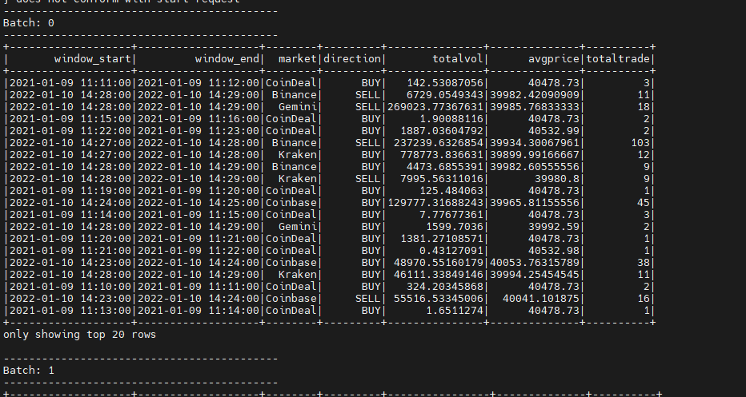
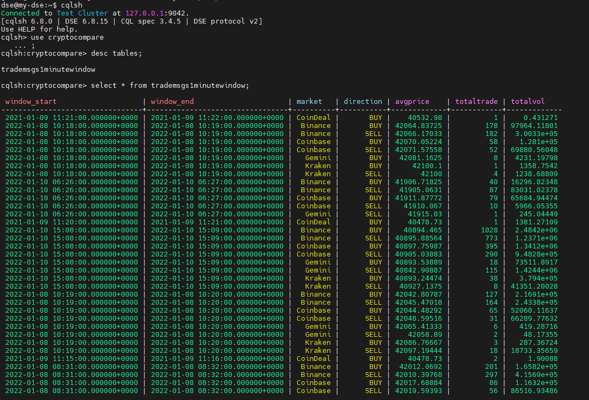

#Spark Streaming CryptoCompare Project
This project demonstrates the use of using Spark Structured streaming available on Datastax Cassandra platform 6.8.15 to consume crypto trade information made available from wss://streamer.cryptocompare.com/v2 through Websockets consumed using Akka.

Running the project has 2 modes using either memory where the data streamed is consumed and aggregrations displayed on console or by using kafka as a messaging bus where data consumed from the websockets is first sent to kafka broker and Spark is used to consume the data, process it and result sent to a cassandra database.


### Setup

1. Create a free account on CryptoCompare by going to the site below.
``` 
    https://min-api.cryptocompare.com/ 
```
 
2. Follow the instructions to setup your API_KEY. This API_KEY is what will be used to stream live messages from the websocket to our Spark application.
3. Build this project by running
``` 
    sbt clean package
```

4. Next, transfer the jar file to your spark cluster environment.


### Running the App: Memory Mode
To run the application in memory mode, copy and paste the command as shown below to submit your application. it is also assumed you already have your api key.

```
dse spark-submit --packages "com.typesafe.akka:akka-stream_2.11:2.5.32,com.typesafe.akka:akka-actor_2.11:2.5.32,\
com.typesafe.akka:akka-http_2.11:10.1.15,com.typesafe.akka:akka-http-jackson_2.11:10.1.15,com.typesafe.akka:akka-http-spray-json_2.11:10.1.15"\
 --master 'local[*]' --conf spark.sql.shuffle.partitions=8\
 akka-websockets-spark-cassandra_2.11-0.1.jar --mode memory --timeout 150 yourapikey

```
This should start your streaming application and you should see results on your console.



### Running the App: Kafka Mode
To run in kafka mode, you will need to perform some additional steps.

1. Create your kafka broker or run docker-compose up on docker-compose.yml file already provided.
2. Create the necessary kafka topic and take note of it.
3. Log on to the Cassandra shell and create a new keyspace
   ```
   create keyspace if not exists cryptocompare with replication = {'class': 'SimpleStrategy', 'replication_factor': 1};
   ```
4. Create the needed table: 
   ```
   CREATE TABLE trademsgs1minutewindow (
    window_start timestamp,
    window_end timestamp,
    market text,
    direction text,
    totalvol double,
    avgprice double,
    totaltrade bigint,
    PRIMARY KEY ((window_start, window_end), market, direction));
   ```
Finally, Submit your application to the cluster by entering the command below.
```
    dse spark-submit --packages "com.typesafe.akka:akka-stream_2.11:2.5.32,com.typesafe.akka:akka-actor_2.11:2.5.32,\
    com.typesafe.akka:akka-http_2.11:10.1.15,com.typesafe.akka:akka-http-jackson_2.11:10.1.15,com.typesafe.akka:akka-http-spray-json_2.11:10.1.15,\
    org.apache.spark:spark-streaming-kafka-0-10_2.11:2.4.0,org.apache.spark:spark-sql-kafka-0-10_2.11:2.4.0,\
    org.apache.kafka:kafka_2.11:2.2.1,org.apache.kafka:kafka-streams:2.2.1"\
     --master 'local[*]' --conf spark.sql.shuffle.partitions=8\
     akka-websockets-spark-cassandra_2.11-0.1.jar --mode kafka --timeout 300\
     --kafkabroker yourkafkabroker:9092 --kafkatopic cryptocompare --cassandraurl yourcassandraurl\
     yourapikey
```
Log on to your cassandra cluster to view data streamed in real time.



####_Improvements are welcomed! Please feel free to submit a pull request!_


